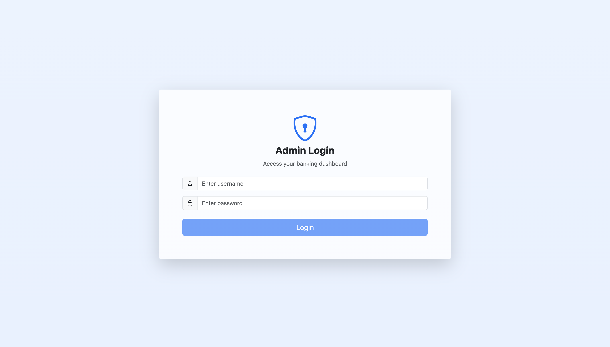
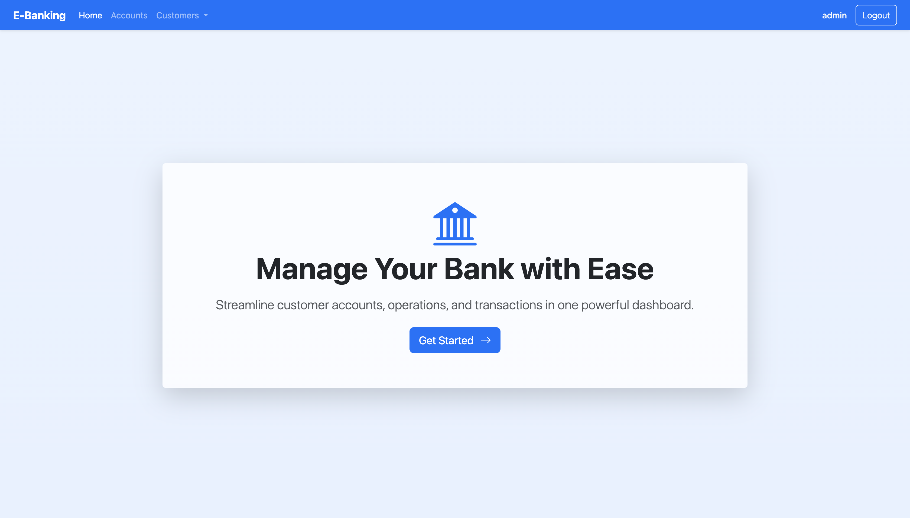
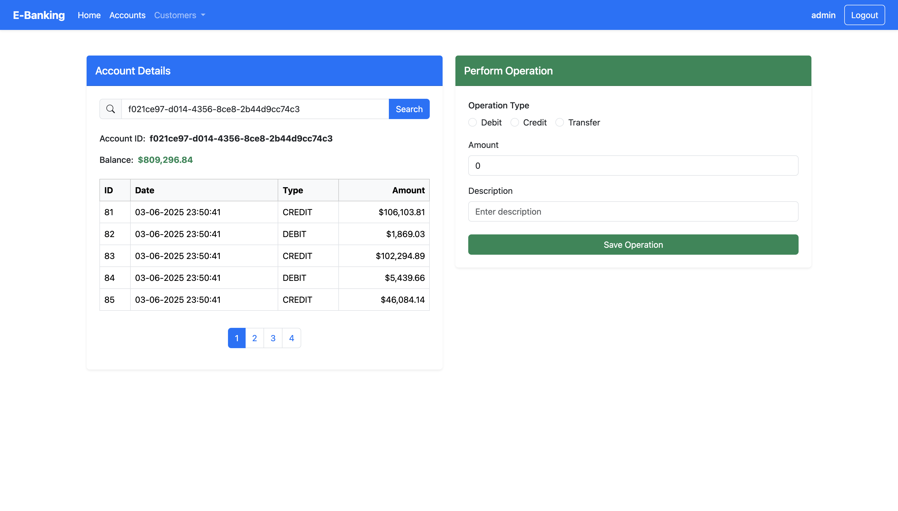
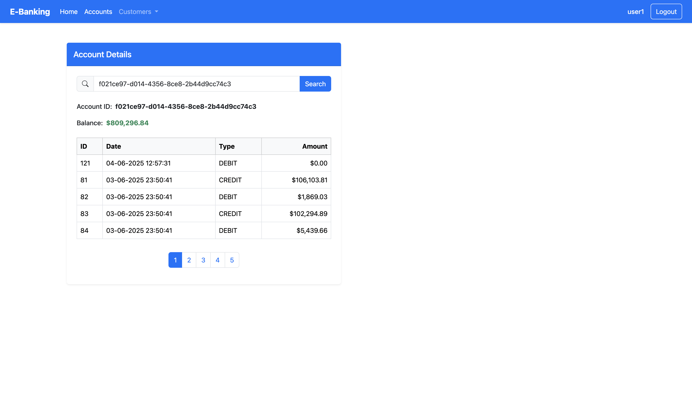
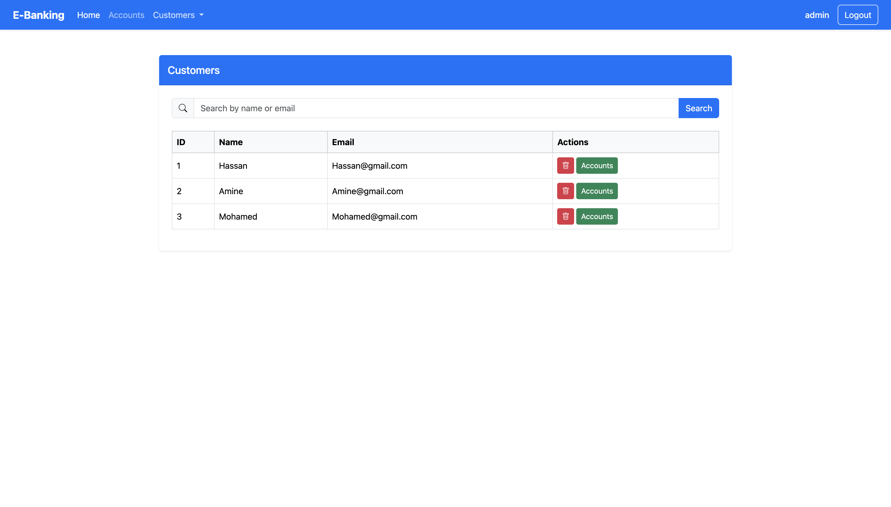
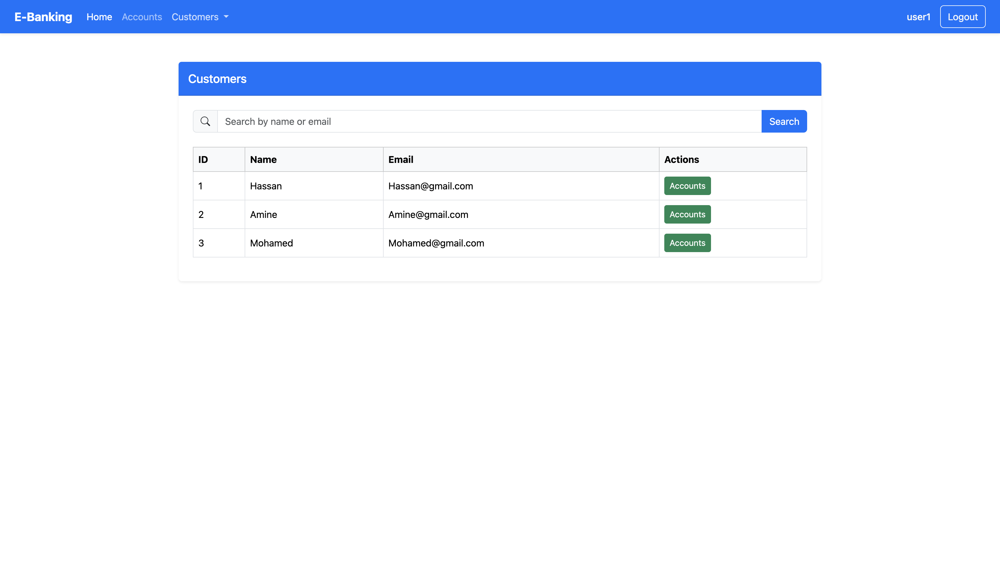
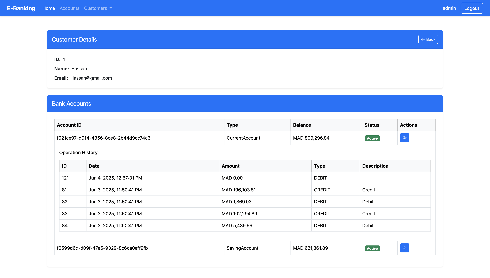
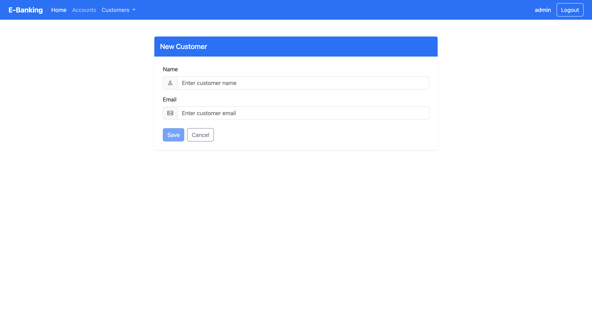

# E-Banking Application

## Table of Contents
- [Overview](#overview)
- [Features](#features)
  - [Backend (`ebanking-backend`)](#backend-ebanking-backend)
  - [Frontend (`ebanking-frontend`)](#frontend-ebanking-frontend)
- [App Pages](#app-pages)
  - [Login](#login)
  - [Home](#home)
  - [Accounts](#accounts)
  - [Customers](#customers)
  - [Customer Account Details](#customer-account-details)
  - [New Customer](#new-customer)
- [Technologies](#technologies)
  - [Backend](#backend)
  - [Frontend](#frontend)
- [Prerequisites](#prerequisites)
- [Setup Instructions](#setup-instructions)
  - [Backend (`ebanking-backend`)](#backend-ebanking-backend-1)
  - [Frontend (`ebanking-frontend`)](#frontend-ebanking-frontend-1)
- [Usage](#usage)
- [Project Structure](#project-structure)
  - [Backend (`ebanking-backend`)](#backend-ebanking-backend-2)
  - [Frontend (`ebanking-frontend`)](#frontend-ebanking-frontend-2)
- [Development Journey](#development-journey)
- [Future Improvements](#future-improvements)
- [Contributing](#contributing)

## Overview
The E-Banking Application is a full-stack web application designed to manage customers and their bank accounts. It provides functionalities for viewing customer details, managing account operations (debit, credit, transfer), and secure authentication using JWT. The backend is built with Spring Boot, and the frontend is developed using Angular 19 with a responsive Bootstrap-based UI.

## Features
### Backend (`ebanking-backend`)
- **Customer Management**: Create, retrieve, search, and delete customers via RESTful APIs.
- **Account Management**: Retrieve account details, view transaction history, and perform debit, credit, and transfer operations.
- **Security**: JWT-based authentication with role-based access control (USER, ADMIN roles). CORS configured to allow frontend communication.
- **Endpoints**:
  - `POST /auth/login`: Authenticate users and issue JWT tokens.
  - `GET /customers`: List all customers.
  - `GET /customers/search?keyword={kw}`: Search customers by keyword.
  - `POST /customers`: Create a new customer.
  - `DELETE /customers/{id}`: Delete a customer.
  - `GET /accounts/{accountId}/history?page={p}&size={s}`: Retrieve account history with pagination.
  - `POST /accounts/debit`: Debit an account.
  - `POST /accounts/credit`: Credit an account.
  - `POST /accounts/transfer`: Transfer funds between accounts.

### Frontend (`ebanking-frontend`)
- **Customer Management**:
  - View a list of customers with their ID, name, and email.
  - Search customers by keyword.
  - Add new customers with form validation (name, email).
  - Delete customers with confirmation prompts.
- **Account Management**:
  - Search accounts by ID to view balance and transaction history.
  - Perform debit, credit, and transfer operations with form inputs for amount, description, and destination account (for transfers).
  - Paginated transaction history display.
- **Authentication**:
  - Login page to authenticate users and obtain JWT tokens.
  - Logout functionality to clear tokens and redirect to login.
  - Not-authorized page for restricted access attempts.
  - HTTP interceptor to attach JWT tokens to API requests.
  - Route guards to protect authenticated routes.
- **UI Components**:
  - Responsive navbar for navigation.
  - Admin template for layout consistency.
  - Bootstrap 5 for styling, with Bootstrap Icons for visual elements.

## App Pages
Below are screenshots of the key interfaces in the E-Banking Application, showcasing the user experience for both Admin and User roles. Each interface includes a description and its purpose.
### Login

- **Description**: The Login page features a clean, centered form with fields for username and password, styled with a modern gradient background and a security-themed icon. It includes input validation and error messages for incorrect credentials.
- **Purpose**: This page is the entry point for both Admin and User roles, allowing secure authentication to access the banking dashboard. It ensures only authorized users can proceed, providing a seamless and secure login experience.

### Home

- **Description**: The Home page displays a full-screen hero section with a bold headline, a motivational tagline, and a prominent call-to-action button. It uses a gradient background and a semi-transparent card for a modern look, accessible to both Admin and User roles.
- **Purpose**: This page welcomes users after login, serving as a central hub to navigate to other features like customer or account management. It sets a professional tone and encourages users to explore the application’s functionalities.

### Accounts
*Admin*

*User*

- **Description**: The Accounts page provides a form to search for accounts by ID, displaying the account’s balance and a paginated transaction history in a responsive table. Admins see additional controls for debit, credit, and transfer operations, while Users see only view-only details.
- **Purpose**: This page enables efficient account monitoring and management. For Users, it offers transparency into account details, while for Admins, it provides powerful tools to perform financial operations, ensuring operational control and oversight.

### Customers
*Admin*

*User*

- **Description**: The Customers page lists all customers in a table with their ID, name, and email, supporting keyword search. Users can view account details by clicking on a customer, while Admins can also delete customers with a confirmation prompt.
- **Purpose**: This page streamlines customer management by providing a clear overview of customer data. It allows Users to access account details for review, while Admins gain the ability to manage customer records, ensuring data accuracy and control.

### Customer Account Details

- **Description**: The Customer Account Details page displays a specific customer’s profile, including their ID, name, email, and a table of their associated bank accounts with balances and transaction histories. It uses a clean, centered card layout with Bootstrap styling, and Admins see options to manage accounts, while Users see view-only details.
- **Purpose**: This page provides a detailed view of a customer’s financial activity, enabling Users to monitor account statuses and Admins to oversee and manage customer accounts efficiently, supporting informed decision-making and customer service.

### New Customer
*Admin*

- **Description**: The New Customer page, accessible only to Admins, features a form to add a new customer with fields for name and email, including validation to ensure correct input. It is styled consistently with other pages, using a centered card layout.
- **Purpose**: This page empowers Admins to expand the customer base by adding new clients efficiently. It ensures data integrity through validation and supports business growth by facilitating customer onboarding.

## Technologies
### Backend
- **Java 17+**: Programming language.
- **Spring Boot 3.x**: Framework for REST API development.
- **Spring Security**: JWT-based authentication and authorization.
- **Nimbus JOSE JWT**: For JWT encoding and decoding.
- **In-Memory User Store**: Temporary user management (user1:12345, admin:12345).
- **Maven**: Dependency management.

### Frontend
- **Angular 19**: Framework for building the SPA.
- **TypeScript**: For type-safe JavaScript.
- **Bootstrap 5**: For responsive UI design.
- **RxJS**: For handling asynchronous operations (e.g., HTTP requests).
- **Angular Reactive Forms**: For form validation and submission.
- **Node.js 18+ & npm**: For package management and build tools.

## Prerequisites
- **Java 17+**: Install JDK (e.g., OpenJDK or Oracle JDK).
- **Maven**: For building the backend.
- **Node.js 18+ & npm**: For the frontend.
- **Git**: For cloning the repository.
- **MySQL/PostgreSQL (optional)**: If replacing the in-memory store with a database.
- **IDE**: IntelliJ IDEA, VS Code, or similar for development.

## Setup Instructions
### Backend (`ebanking-backend`)
1. **Clone the Repository**:
   ```bash
   git clone https://github.com/OsmBHC/ebanking-app.git
   cd ebanking-backend
   ```
2. **Configure Application Properties**:
   - Edit `src/main/resources/application.properties`:
     ```properties
     server.port=8085
     jwt.secret=your-secure-secret-key
     ```
   - Replace `your-secure-secret-key` with a strong secret for JWT signing (e.g., a 256-bit key).
3. **Build and Run**:
   ```bash
   mvn clean install
   mvn spring-boot:run
   ```
   The backend will run on `http://localhost:8085`.

### Frontend (`ebanking-frontend`)
1. **Navigate to Frontend Directory**:
   ```bash
   cd ebanking-frontend
   ```
2. **Install Dependencies**:
   ```bash
   npm install
   ```
3. **Configure Environment**:
   - Edit `src/environments/environment.ts`:
     ```typescript
     export const environment = {
       production: false,
       backendHost: 'http://localhost:8085'
     };
     ```
4. **Run the Application**:
   ```bash
   ng serve
   ```
   The frontend will run on `http://localhost:4200`.

## Usage
1. **Access the Application**:
   - Open `http://localhost:4200` in your browser.
2. **Login**:
   - Use credentials:
     - Username: `user1`, Password: `12345` (USER role)
     - Username: `admin`, Password: `12345` (USER, ADMIN roles)
   - Successful login redirects to the main dashboard.
3. **Navigate Features**:
   - **Customers**: View, search, add, or delete customers.
   - **Accounts**: Search accounts by ID, view transaction history, and perform operations (debit, credit, transfer).
   - **Logout**: Clears the JWT token and redirects to the login page.
4. **Handle Unauthorized Access**:
   - Attempting to access protected routes without a valid token redirects to the not-authorized page.

## Project Structure
### Backend (`ebanking-backend`)
```
ebanking-backend/
├── src/
│   ├── main/
│   │   ├── java/ma/enset/ebankingbackend/
│   │   │   ├── EbankingBackendApplication.java       # Main application entry point
│   │   │   ├── dtos/                                # Data Transfer Objects
│   │   │   │   ├── AccountHistoryDTO.java
│   │   │   │   ├── AccountOperationDTO.java
│   │   │   │   ├── BankAccountDTO.java
│   │   │   │   ├── CreditDTO.java
│   │   │   │   ├── CurrentBankAccountDTO.java
│   │   │   │   ├── CustomerDTO.java
│   │   │   │   ├── DebitDTO.java
│   │   │   │   ├── SavingBankAccountDTO.java
│   │   │   │   └── TransferRequestDTO.java
│   │   │   ├── entities/                            # JPA entities
│   │   │   │   ├── AccountOperation.java
│   │   │   │   ├── BankAccount.java
│   │   │   │   ├── CurrentAccount.java
│   │   │   │   ├── Customer.java
│   │   │   │   └── SavingAccount.java
│   │   │   ├── enums/                               # Enum definitions
│   │   │   │   ├── AccountStatus.java
│   │   │   │   └── OperationType.java
│   │   │   ├── exceptions/                          # Custom exceptions
│   │   │   │   ├── BalanceNotSufficientException.java
│   │   │   │   ├── BankAccountNotFoundException.java
│   │   │   │   └── CustomerNotFoundException.java
│   │   │   ├── mappers/                             # Data mapping
│   │   │   │   └── BankAccountMapperImpl.java
│   │   │   ├── repositories/                        # JPA repositories
│   │   │   │   ├── AccountOperationRepository.java
│   │   │   │   ├── BankAccountRepository.java
│   │   │   │   └── CustomerRepository.java
│   │   │   ├── security/                            # Security configuration
│   │   │   │   ├── SecurityConfig.java
│   │   │   │   └── SecurityController.java
│   │   │   ├── services/                            # Business logic
│   │   │   │   ├── BankAccountService.java
│   │   │   │   └── BankAccountServiceImpl.java
│   │   │   └── web/                                 # REST controllers
│   │   │       ├── BankAccountController.java
│   │   │       └── CustomerRestController.java
│   │   └── resources/
│   │       ├── application.properties               # Configuration (e.g., JWT secret)
│   │       ├── static/                              # Static resources (empty)
│   │       └── templates/                           # Templates (empty)
│   └── test/
│       └── java/ma/enset/ebankingbackend/
│           └── EbankingBackendApplicationTests.java # Unit tests
├── pom.xml                                          # Maven configuration
├── mvnw                                             # Maven wrapper
├── mvnw.cmd                                         # Maven wrapper for Windows
└── HELP.md                                          # Maven help file
```

### Frontend (`ebanking-frontend`)
```
ebanking-frontend/
├── src/
│   ├── app/
│   │   ├── accounts/                            # Account management component
│   │   │   ├── accounts.component.css
│   │   │   ├── accounts.component.html
│   │   │   ├── accounts.component.spec.ts
│   │   │   └── accounts.component.ts
│   │   ├── admin-template/                      # Admin layout component
│   │   │   ├── admin-template.component.css
│   │   │   ├── admin-template.component.html
│   │ TCP, #image
│   │   │   └── admin-template.component.ts
│   │   ├── customer-accounts!                   # Customer accounts component
│   │   │   ├── accounts/
│   │   │   ├── components/
│   │   │   │   ├── customer-accounts.component.css
│   │   │   ├── customer-accounts.component.html
│   │   │   ├── customer-accounts.component.spec.ts
│   │   │   └── customer-accounts.component.ts
│   │   ├── customers/                           # Customer management component
│   │   │   ├── customers.component.css
│   │   │   ├── customers.component.html
│   │   │   ├── customers.component.spec.ts
│   │   │   └── customers.component.ts
│   │   ├── guards/                              # Authentication and authorization guards
│   │   │   ├── authentication.guard.spec.ts
│   │   │   ├── authentication.guard.ts
│   │   │   ├── authorization.guard.spec.ts
│   │   │   └── authorization.guard.ts
│   │   ├── interceptors/                        # HTTP interceptors
│   │   │   ├── app-http.interceptor.service.ts
│   │   │   └── app-http.interceptor.ts
│   │   ├── login/                             # Login component
│   │   │   ├── login.component.css
│   │   │   ├── login.component.html
│   │   │   ├── login.component.spec.ts
│   │   │   └── login.component.ts
│   │   ├── models/                              # Data models
│   │   │   ├── account.model.ts
│   │   │   └── customer.model.ts
│   │   ├── navbar/                            # Navigation bar component
│   │   │   ├── navbar.component.css.html
│   │   │   ├── navbar.component.html
│   │   │   ├── navbar.component.spec.ts
│   │   │   └── navbar.component.ts
│   │   │   ├── new-customer/                        # New customer form component
│   │   │   ├── new-customer.component.css.html
│   │   │   ├── new-customer.component.html
│   │   │   ├── new-customer.component.spec.ts
│   │   │   └── new-customer.component.ts
│   │   ├── not-authorized/                      # Unauthorized access component
│   │   │   ├── not-authorized.component.css
│   │   │   ├── not-authorized.component.html
│   │   │   ├── not-authorized.component.ts.ts
│   │   │   └── not-authorized.component.ts
│   │   ├── services/                          # Services for API communication
│   │   │   ├── account.service.spec.ts
│   │   │   ├── account.service.ts
│   │   │   ├── auth.service.spec.ts
│   │   │   ├── auth.service.ts
│   │   │   ├── customer.service.spec.ts
│   │   │   └── customer.service.ts
│   │   ├── app.component.css                    # Root component styles
│   │   ├── app.component.html                   # HTML for root component
│   │DEDOWN ├── app.component.html
│          ├── app.component.spec.ts                # Tests for root component
│   │   ├── app.component.ts                     # Logic for root component
│   │   ├── app.config.ts                      # Configuration for the app
│   │   └── app.routes.ts                        # Routes configuration for the app
│   ├── environments/                            # Environment configuration
│   │   └── environment.ts
│   ├── index.html                               # Main HTML file
│   ├── main.ts                                  # Bootstrap file for the application
│   └── styles.css                               # Global styles
├── public/
│   └── favicon.ico                              # Favicon for the application
├── angular.json                                 # Angular CLI configuration
├── package.json                                # Node.js dependencies
├── package-lock.json                               # Dependency lock file
├── tsconfig.app.json                               # TypeScript configuration for the app
├── tsconfig.json                                # TypeScript configuration
└── tsconfig.spec.json                           # TypeScript configuration for tests
```

## Development Journey
1. **Initialized Project**:
   - Created `ebanking-backend` with Spring Boot for REST APIs.
   - Initialized `ebanking-frontend` with Angular 19 (`ng new ebanking-frontend`).
2. **Customer Management**:
   - Implemented backend APIs for customer CRUD operations.
   - Built frontend components to list, manage customers, add, manage customers, and delete customers.
   - Added backend APIs for account history, transactions, and operations (debit, credit, transfer).
   - Created components in the frontend to search accounts, manage transactions, view transactions, manage account history, and perform operations with pagination.
   - Configured JWT-based authentication in the backend with `SecurityConfig` and configured `SecurityController`.
   - Added frontend authentication with login, implemented logout, logout functionality, implemented interceptors, implemented guards, and, and handled unauthorized access handling.
   - Integrated Bootstrap 5 for a responsive UI design.
   - Added a navbar and admin template for consistent navigation consistency.
   - Added a comprehensive README with setup instructions, usage, and project details, and documentation.
   - Regularly committed changes to the GitHub repository with clear messages (e.g., initial setup, component additions, security implementation).

## Future Improvements
- **Enhanced Customer Management**:
  - Add input fields for **edit/update** functionality, **edit** functionality, and **advanced search** capabilities for customers to enhance usability and data management.
- **Enhanced Account Management**:
   - Implement **account creation**, **create accounts**, **edit account** functionality, **and **detailed search** features for accounts to improve account administration.
- **Operation Tracking**:
  - Record the **authenticated user’s identifier** for every **customer**, **account**, **and**, and **operation** creation or modification to ensure **traceability**.
- **User Account and Password Management**:
   - Enable **user account management**, including **password management** functionality (e.g., password change functionality), to enhance **security** and **user control**.
- **Dashboard with ChartJS**:
   - Develop a **dashboard** using **ChartJS** (via `ng2-charts`) to display **graphs** and **statistics** (e.g., account balances, transaction trends) for **informed decision-making**.
- **Additional Features**:
   - Explore **additional functionalities** like **transaction categorization**, **multi-currency support**, or **email notifications** for operations **for** **enhanced financial operations**.
- **Database Integration**:
   - Replace the **in-memory** user store with **a** **persistent database** (e.g., **MySQL**) for **robust user and data management**.
- **UI/UX Enhancements**:
   - Implement **role-based UI** restrictions (e.g., admin-only views for admin-only actions) and **user feedback** enhancements (e.g., **toast notifications**) for **improved user experience**.
- **Deployment**:
   - Deploy the **application** to **a** **cloud platform** like (e.g., **AWS**, **Heroku**) for **production use**.

## Contributing
1. Fork the repository.
2. Create a **feature** branch (**e.g.,** `git checkout -b feature/YourFeature`**).
3. **Commit** your **changes (**e.g.,** `git commit -m 'feat: add YourFeature'`**).
4. **Push** your changes to the branch (**e.g., `git push origin feature/YourFeature**).
5. **Open** a **pull request**.